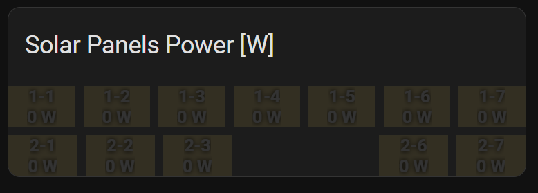

# Solax Data Fetcher and MQTT Publisher

This Python script retrieves real-time data from Solax inverters via their API and publishes the data to an MQTT broker. It supports Home Assistant discovery and Healthchecks.io monitoring for operational status.

This is designed mainly for Microinverters from the X1-Micro range.

---

## Features

- Fetches real-time data from multiple Solax inverters.
- Publishes data to an MQTT broker.
- Supports Home Assistant MQTT discovery for energy monitoring.
- Aggregates totals across all inverters.
- Sends success or failure pings to Healthchecks.io for monitoring.

---

## Requirements

- Python 3.8+
- Solax API access with a valid `tokenId`.
- MQTT broker (e.g., Mosquitto, Home Assistant MQTT).
- Optional: Healthchecks.io for uptime monitoring.

---

## Installation

1. **Clone the repository**:
   ```bash
   git clone https://github.com/raddzz/solax-mqtt.git
   cd solax-mqtt
   ```

2. **Install dependencies**:
   ```bash
   pip install -r requirements.txt
   ```

3. **Set up the environment file**:
   Copy the example environment file and edit it with your configuration:
   ```bash
   cp .env.example .env
   ```

4. **Edit `.env` with your configuration**:
   - Replace placeholders with actual values.
   - Example:
     ```plaintext
     MQTT_BROKER=192.168.1.100
     MQTT_PORT=1883
     MQTT_USERNAME=homeassistant
     MQTT_PASSWORD=your_mqtt_password
     MQTT_BASE_TOPIC=homeassistant
     API_URL=https://global.solaxcloud.com/api/v2/dataAccess/realtimeInfo/get
     API_TOKEN_ID=your_token_id
     SERIAL_NUMBERS=serial1,serial2,serial3
     HEALTHCHECKS_URL=https://hc-ping.com/your-unique-id
     ```

---

## Usage

Run the script directly:
```bash
python solax_mqtt.py
```

The script will:
- Fetch data every 5 minutes (at `hh:mm:10` where `mm` is a multiple of 5).
- Publish individual inverter data and aggregated totals to the MQTT broker.

---

## Running the Script in the Background

To keep the script running in the background, use one of the following methods:

### Option 1: Using `screen`
1. Start a new screen session:
   ```bash
   screen -S solax_mqtt
   ```
2. Run the script:
   ```bash
   python solax_mqtt.py
   ```
3. Detach from the session (leave it running in the background):
   ```bash
   Ctrl+A, then press D
   ```
4. Reattach to the session when needed:
   ```bash
   screen -r solax_mqtt
   ```

### Option 2: Using `supervisor`
1. Install `supervisor`:
   ```bash
   sudo apt install supervisor
   ```
2. Create a configuration file for the script (e.g., `/etc/supervisor/conf.d/solax_mqtt.conf`):
   ```plaintext
   [program:solax_mqtt]
   command=python /path/to/solax_mqtt.py
   autostart=true
   autorestart=true
   stderr_logfile=/var/log/solax_mqtt.err.log
   stdout_logfile=/var/log/solax_mqtt.out.log
   ```
3. Reload and start `supervisor`:
   ```bash
   sudo supervisorctl reread
   sudo supervisorctl update
   sudo supervisorctl start solax_mqtt
   ```

---

## Configuration

### Environment Variables

| Variable          | Description                                     | Example                                                           |
|--------------------|-------------------------------------------------|------------------------------------------------------------------|
| `MQTT_BROKER`      | Address of your MQTT broker                    | `192.168.1.100`                                                   |
| `MQTT_PORT`        | Port of your MQTT broker                       | `1883`                                                            |
| `MQTT_USERNAME`    | Username for MQTT authentication               | `homeassistant`                                                   |
| `MQTT_PASSWORD`    | Password for MQTT authentication               | `your_mqtt_password`                                              |
| `MQTT_BASE_TOPIC`  | Base topic for MQTT messages                   | `homeassistant`                                                   |
| `API_URL`          | Solax API URL                                  | `https://global.solaxcloud.com/api/v2/dataAccess/realtimeInfo/get`|
| `API_TOKEN_ID`     | Solax API token ID                             | `your_api_token_id`                                               |
| `SERIAL_NUMBERS`   | Comma-separated list of inverter serial numbers| `serial1,serial2,serial3`                                         |
| `HEALTHCHECKS_URL` | Healthchecks.io monitoring URL (optional)      | `https://hc-ping.com/your-id`                                     |

---

## Healthchecks.io Integration

- If the `HEALTHCHECKS_URL` is provided, the script will send success or failure pings to Healthchecks.io after each fetch cycle.
- Leave `HEALTHCHECKS_URL` empty in the `.env` file to disable Healthchecks.io pings.

---

## MQTT Integration with Home Assistant

The script uses MQTT discovery to integrate seamlessly with Home Assistant. Ensure your MQTT broker is configured in Home Assistant, and sensors will be auto-discovered under the `homeassistant` topic.

## Home Assistant Card Example

Below is an example of a Home Assistant card to display individual panel data using the `button-card` integration.



### YAML Configuration Example

```yaml
button_card_templates:
  pv_panel:
    aspect_ratio: 200/120
    show_entity_picture: true
    show_icon: false
    show_state: true
    styles:
      name:
        - font-weight: bold
      card:
        - '--keep-background': 'true'
        - border-radius: 5%
        - text-shadow: 0px 0px 5px black
        - padding: '-10%'
        - color: white
        - text-transform: uppercase
        - font-weight: bold
        - background-color: rgb(255,235,171)
        - filter: |
            [[[
              return "brightness("+Math.min(100*(Math.round(Number(entity.state)) / 455 + 0.2), 100) + "%)"
            ]]]
    state_display: |
      [[[
        return Math.round(Number(entity.state))+" W" 
      ]]]
views:
  - type: sections
    max_columns: 4
    title: Test
    path: test
    sections:
      - type: grid
        cards:
          - type: custom:stack-in-card
            title: Solar Panels Power [W]
            mode: vertical
            cards:
              - type: horizontal-stack
                cards:
                  - type: custom:button-card
                    template: pv_panel
                    entity: sensor.solax_inverter_SERIALNUMBER_panel_1_dc_power
                    name: 1-1
                  - type: custom:button-card
                    template: pv_panel
                    entity: sensor.solax_inverter_SERIALNUMBER_panel_1_dc_power
                    name: 1-2
                  - type: custom:button-card
                    template: pv_panel
                    entity: sensor.solax_inverter_SERIALNUMBER_panel_2_dc_power
                    name: 1-3
                  - type: custom:button-card
                    template: pv_panel
                    entity: sensor.solax_inverter_SERIALNUMBER_panel_1_dc_power
                    name: 1-4
                  - type: custom:button-card
                    template: pv_panel
                    entity: sensor.solax_inverter_SERIALNUMBER_panel_2_dc_power
                    name: 1-5
                  - type: custom:button-card
                    template: pv_panel
                    entity: sensor.solax_inverter_SERIALNUMBER_panel_2_dc_power
                    name: 1-6
                  - type: custom:button-card
                    template: pv_panel
                    entity: sensor.solax_inverter_SERIALNUMBER_panel_1_dc_power
                    name: 1-7
              - type: horizontal-stack
                cards:
                  - type: custom:button-card
                    template: pv_panel
                    entity: sensor.solax_inverter_SERIALNUMBER_panel_2_dc_power
                    name: 2-1
                  - type: custom:button-card
                    template: pv_panel
                    entity: sensor.solax_inverter_SERIALNUMBER_panel_2_dc_power
                    name: 2-2
                  - type: custom:button-card
                    template: pv_panel
                    entity: sensor.solax_inverter_SERIALNUMBER_panel_1_dc_power
                    name: 2-3
                  - type: custom:button-card
                    template: blank
                    name: ''
                  - type: custom:button-card
                    template: blank
                    name: ''
                  - type: custom:button-card
                    template: pv_panel
                    entity: sensor.solax_inverter_SERIALNUMBER_panel_1_dc_power
                    name: 2-6
                  - type: custom:button-card
                    template: pv_panel
                    entity: sensor.solax_inverter_SERIALNUMBER_panel_2_dc_power
                    name: 2-7

```

### Credit
This card design is inspired by a [Home Assistant Community post by @langestefan](https://community.home-assistant.io/t/per-panel-pv-power-energy-visualization-solaredge-optimizer-data/599147). Special thanks for the contribution to the Home Assistant ecosystem!

## Future Plans

In the future, I would like to explore obtaining the inverter data locally rather than relying on the Solax API. The Microinverters host a HTTP site, and should be able to support some sort of local communication as I believe they communicate locally with the ECC gateway. 


## Contributing

1. Fork the repository.
2. Create a new branch:
   ```bash
   git checkout -b feature-name
   ```
3. Commit your changes and push:
   ```bash
   git commit -m "Description of changes"
   git push origin feature-name
   ```
4. Submit a pull request.

---

## License

This project is licensed under the MIT License. See `LICENSE` for more details.

---

## Support

For issues or questions, open a GitHub issue or contact [james@jamesradley.net](mailto:james@jamesradley.net).
